# Workshop-Ionic

Notre but :


Bonjour à tous et bienvenue à ce Workshop Ionic, dans lequel nous allons développer une **ToDO List** grâce à l'environement Ionic, avec une base de donnée **FireBase**, en respectant une architecture **Angular.**

Pour ce faire, nous allons suivre ensemble toute une série d'étapes pour, au final, pouvoir créer des tâches, les afficher et les supprimer.

Le tout en utilisant des balises `<ion- .... >`

## Installaton du projet

Pour commencer, installez **Ionic** en global avec la commande:
`npm install -g ionic`

Ca va mettre un peu de temps à s'installer.

Ensuite lancez le projet où vous voulez dans votre ordinateur en tapant dans le terminal `ionic start Todolist blank`.

Tous les fichiers nécessaires se créent.

Le fait de mettre le " blank " va faire en sorte d'avoir un projet "vide". <br>
A la place, on aurait pu mettre "tabs" pour une interface avec plusieurs onglets, "conference" pour un site avec toutes une séries de fonctionnalités pré-faites, comme une carte, un calendrier etc ..., [ou d'autres encore](https://ionicframework.com/docs/v3/cli/starters.html)
De notre coté, on va tout faire à la main en commençant de "rien".

Enfin, tapez `ionic serve`.

Vous êtes maintenant prêt à rentrer dans le vif du sujet: le code de notre application.

## Créeer son thème

Pour commencer on peut faire un tour de l'architecture. On se rend compte que c'est une architecture Angular. Pas de panique, ici nous n'irons pas dans les méandres du _routing_ angular, nous allons juste utiliser l'architecture pour insérer toutes nos fonctionnalités.

Comme vous pouvez le voir, les feuilles de style sont en SCSs, donc n'oubliez pas de lancer votre plugin "Live Sass Compiler" afin de compiler en direct.

Nos efforts vont se concentrer sur les fichiers `.ts`, `.html` et `.scss` du dossier `src/app/home`, avec quelques détours pour quelques lignes dans d'autres parties de notre projet, mais tout sera expliqué (je l'espère) dans ce tuto.

Maintenant que vous êtes un peu familier avec notre environnement de travail, rendez-vous dans `src/app/home/home.page.htlm`.

Pour commencer, changez le titre de l'application dans la balise. :
`<ion-title> [Votre prénom]'s Todolist</ion-title>`.

Ensuite, allez dans le ficher `src/theme/variable.scss` et changer la première valeur (`--ion-color-primary`) pour la mettre en **#5a8ca4**.

Ici on peut voir qu'Ionic possède toute une série de [couleurs de base pré-enregistrées](https://ionicframework.com/docs/theming/colors) qui peuvent être utilisée plus facilement. Ces couleurs possèdent aussi des variantes (contrast, shade et tint) qui sont utilisable.<br>
Il est également possible de créer de [nouvelles couleurs](https://ionicframework.com/docs/theming/colors#new-color-creator) si on en a souvent besoin.

Retour dans notre fichier `src/app/home/home.page.html` pour y modifier la couleur utilisée:

```
<ion-toolbar color="primary">
  <ion-title>
     Simon's Todolist
  </ion-title>
</ion-toolbar>
```

Voila, notre en-tête est toute belle.

A présent, téléchargez l'image [bg](./asset/bg.jpg).

Videz l'intérieur des balises `<ion-content>` et y intégrer une div ayant comme class `bg-img`.

Ensuite, allez dans `src/app/home/home.page.scss` et mettez

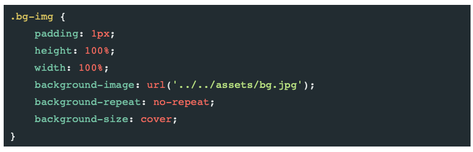

Maintenant que nous avons un visuel, nous allons injecter les premières valeurs

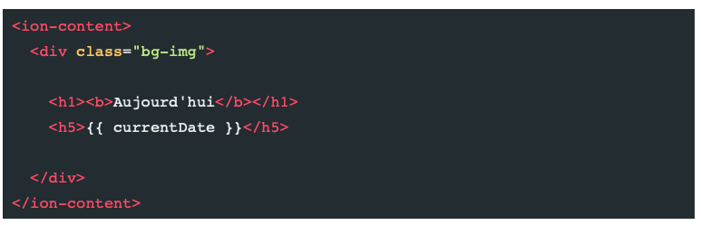

On va régler le problème de currentDate plus tard.

Vous pouvez bien sûr changer les textes avec par exemple "Bonjour [Votre prénom]"

Mettons quand même un peu de style, pour avoir un truc qui ressemble à quelque chose:

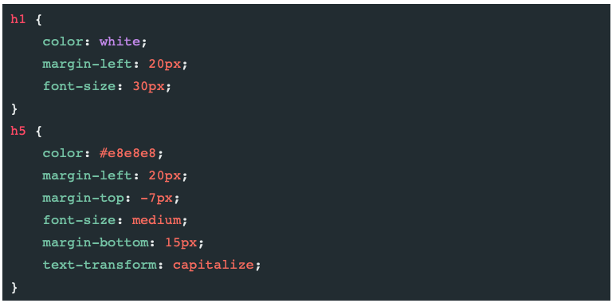

Pour finir cette partie, allez dans le fichier `src/app/home/home.page.ts`.

Dans export, déclarez `currentDate` comme étant une `string` :

```
export class HomePage {
    currentDate: string;

```

Et dans le constructor, ajoutez la variable `currentDate` grâce à l'objet date de JavaScript

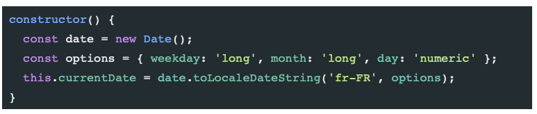

A présent, vous devriez avoir ceci:


Vous avez terminez la première étape: Bravo !!!!

On passe à la suite.

## Connecter son applicaton à FireBase

Pour ce faire, vous devrez commencer par avoir un compte Google et vous rendre sur le site de [FireBase](https://firebase.google.com).

Ensuite, dans un nouvel onglet du termninal, faites la commande `npm install firebase @angular/fire --save`.

Une fois ce package installé, allez dans `src/app/app.module.ts`.

Ici, nous allons importer d'une part **AngularFireModule** qui va associer notre application Ionic avec Firebase, et d'autre part **AngularFireDatabaseModule** pour utiliser les fonctions associées aux bases de données de Firebase.

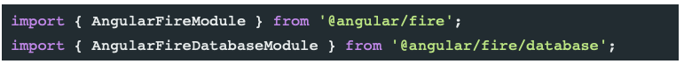

Maintenant nous allons connecter Firebase à notre application.

Pour commencer, sur Firebase, connectez-vous grâce à votre compte Google.

Vous avez alors accès à la console. Clique sur "ajouter un projet", entrer le nom de votre projet, suivant, activez Google Analytics, suivant, acceptez tout et créez le projet.

Ca peut prendre un peu de temps.
Vous avez alors accès à votre projet.

Pour faire la liaison avec votre appli, cliquez sur l'onglet web dans l'ajout d'application:


Vous entrez un nom, et cliquez sur `enregistrer l'application`.

Vous avez alors un bloc de code, copiez-collez la partie
`
var firebaseConfig = {

Différents code

}
`

et collez ce code dans l'export de `src/app/app.module.ts`.

Il faut ensuite déclarer ces packages.<br>
Vous devez arriver un fichier qui ressemble à ça:

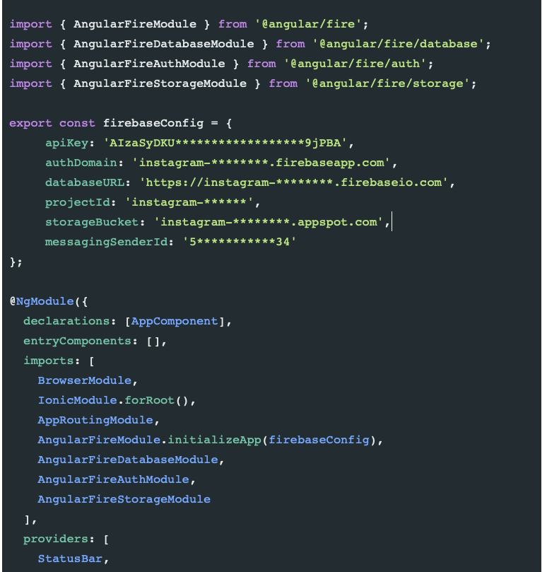

NB: c'est grâce à la fonction `initializeApp` que notre projet est lié à l'application.

A présent, allons dans la partie `Database` de Firebase que vous trouvez dans l'onglet Développer (sur la gauche).

Cliquez sur "Créer une base de données", continuer en mode production, puis changez votre région en "eur3 (europe-west)".
De nouveau, ça prend un peu de temps.

Ensuite, c'est important: tout en haut, à coté de "Database", **passer de Cloud Firestore à RealTime Database !!!**

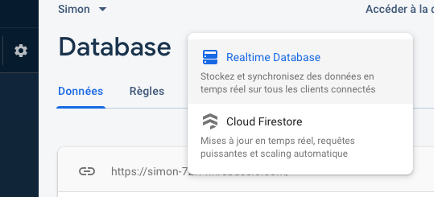

De retour dans le code pour finir cette liaison.

Dans `src/app/home/home.page.ts` importez le module _AngularFireDatabase_ :

`import { AngularFireDatabase } from '@angular/fire/database';`

et déclarez ce module dans le constructor(), entre les paranthèses pour pouvoir l'utiliser dans le reste de la page.

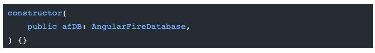

Voila, la liaison est finie.
C'est la partie la moins marrante et la plus abstraite, donc si vous êtes arrivé ici, ben vous êtes une re-sta et Good Job, vous irez au paradis !! <br>
Au niveau du visuel, rien n'a changé, mais derrière tout fonctionne à présent!!

NB: Regardez quand même dans la console de l'inspecteur que rien ne soit cassé, c'est hautement probable.

## Ajouter une tâche à notre TodoList

Vous me direz: "T'es bien gentil Simon, mais on est loin du résultat". Je sais, donc je vous dis "Fooooooonce, le temps file et je passe pas ma journée ici !!! "

En avant pour une partie bien plus funne (la féminisation de la langue, c'est important !! ): l'ajout de tâche.

C'est à partir de cette partie que vous allez voir le plus de "particularités" d'**Ionic** et les avantages disponibles. Je vais en expliquer quelques dans le texte, mais il y en aura d'autres que je vous laisse découvrir.

Excusez-moi déjà pour le grand nombre de photos mais c'est plus simple et plus explicite qu'un long texte.

Pour commencer, nous allons créer un formulaire d'envoi qui contiendra simplement un champ de texte pour défnir la tâche, et plus tard un bouton de validation.

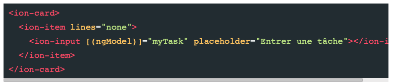

Petite explication:

- `lines="none"` re-style un peu le champ (esssayez sans pour voir la différence).
- `[(ngModel)]="myTask"` sert à lier avec `home.page.ts` pour utiliser `myTask`.

On va donc aller déclarer le `myTask` en tant que string sous le `currentDate`.

Ajoutons à présent le bouton "ajouter" en insérant ce bout de code dans l' `ion-input` déjà là.

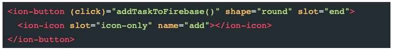

C'est ici qu'on rencontre pour la première fois les icones Ionic.

En effet, Ionic possède une bibliothèque d'icônes que l'on peut appeler avec leur nom. Toutefois, il faut soit les connaitre, soit aller voir dans la [doc](https://ionicons.com). Ici: `name="add"`.

Nous voyons aussi pour la première fois une commande très utile pour le placement: le `slot`.<br>
Elle permet de placer un objet. Icon-only, je sais pas ce que ça veut dire, mais il y a aussi end et start qui sont très utilisés et qui mettre à gauche et à droite.<br>
En effet, Ionic utilise déjà les nouvelles pratiques CSS (cf veille de Rimbaud).

Enfin, le `(click)="addTaskToFirebase()"` appelle au click la fonction que nous allons implanter dans le fichier Typescript.

Encodez ce code dans le fichier `home.page.ts`, sous le constructor (après les accolades du constructor).

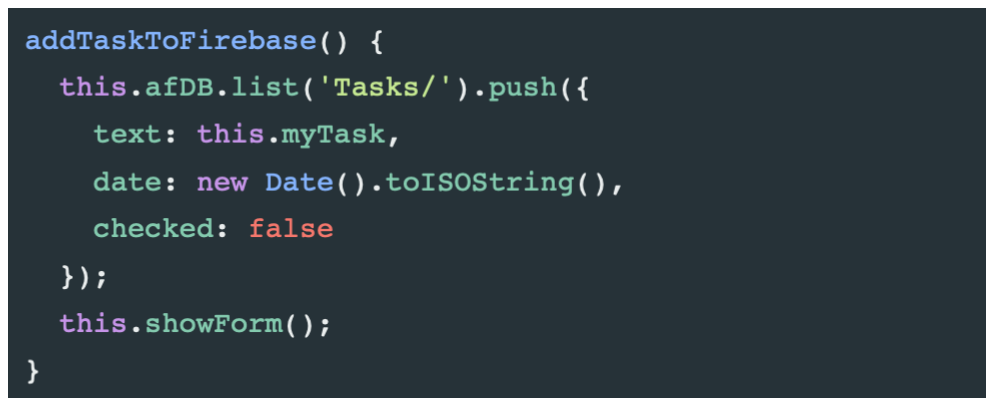

Je vous laisse comprendre ce que fait cette fonction. J'expliquerai juste que `afDB` est la fonction de liaison à Firebase que nous avons déjà déclarée un peu plus haut dans le constructor. C'est grâce à cette déclaration que nous pouvons le réutiliser ici.

Ensuite nous détaillons les champs créés dans Firebase lors de l'appel de `addTaskToFirebase()`.

Maintenant, exécutons la foncton `showForm()`qui va cacher ou montrer le formulaire d'envoi. Ainsi, lorsque que nous envoyons une nouvelle tâche, nous revenons à la page d'acceuil.

Pour commencer, déclarez dans l'export la variable `addTask` en boolean :

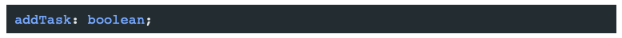

Ensuite appelez cette variable dans le fonction `showForm()`:

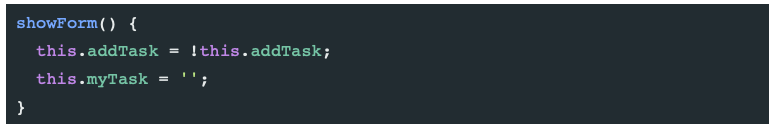

Grâce à cette fonction imbriquée dans le fonction `addTaskToFirebase()`, à chaque appel à cette dernière, d'une part nous inversons la valeur de `addTask` et d'autre part nous mettons `myTask`, c'est à dire la nouvelle tâche à encoder à du vide.

Maintenant que la fonction pour afficher ou montrer cette option est implémentée, il nous faut créer le bouton qui va faire cette action.

Dans `home.page.html`, hors de notre balise `<ion-card>`, ajoutez ce code :

```
<ion-button *ngIf="!addTask" (click)="showForm()" expand="block" class="add-button">
  <ion-icon name="add" slot="start"></ion-icon>
  Ajouter une tâche
</ion-button>

<ion-button *ngIf="addTask" (click)="showForm()" expand="block" class="add-button">
  <ion-icon name="close" slot="start"></ion-icon>
  Annuler
</ion-button>
```

Nous introduisons ici le `*ngIf`, preuve qu'Angular est assez utile dans contexte pour changer l'affichage d'éléments en fonction de la variable `addTask`.
Sur le click, nous appelons également la fonction `showForm()` qui va justement changer la valeur de cette donnée.
On peut aussi voir toute une série de fonctionnalités propres à Ionic, comme l'appel d'icones, le principe des "slot" ou un expand.

Mettez un peu de style à tout ça, par exemple:

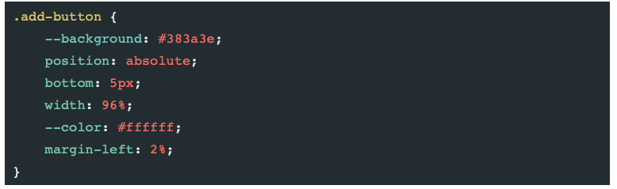

Bravo, vous êtes capables d'ajouter des tâches, tout du moins sur le visuel. Vous devriez avoir un écran qui ressemble à celui-ci:

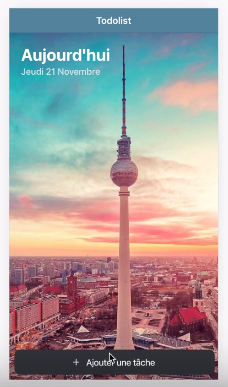

et au click sur le bouton d'ajout, vous avez ce visuel:

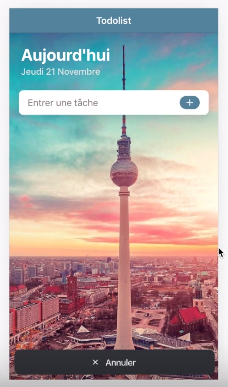

Mais ce n'est pas assez, on va pousser le truc un peu plus loin.

## Afficher nos Tâches sur notre écran

C'est bien beau d'encoder des tâches, mais si rien ne s'affiche pour nous rappeler de les faire, ça sert pas à grand chose. C'est notre mission pour cette étape.

Commençons par créer la variable `tasks= []`dans `home.page.ts`.

Nous allons utiliser ce tableau pour y "pusher" nos données et pouvoir les ressortir à l'affichage.

Pour ce faire, créez la fonction `getTasks()`:

```
getTasks() {
  this.afDB.list('Tasks/').snapshotChanges(['child_added', 'child_removed']).subscribe(actions => {
    this.tasks = [];
    actions.forEach(action => {
      this.tasks.push({
        key: action.key,
        text: action.payload.exportVal().text,
        hour: action.payload.exportVal().date.substring(11, 16),
        checked: action.payload.exportVal().checked
      });
    });
  });
}
```

Analysons ce code:

- `this.afDB.list('Tasks/')` : nous travaillons dans Firebase dans la base de donnée appelée Tasks.
- `snapshotChanges(['child_added', 'child_removed'])` : pour chaque modification, nous refaisons un check dans la db pour mettre à jour nos données affichées.
- `this.tasks = [];`: Dans quel tableau je mets mes tâches.
- `actions.forEach(action => { this.tasks.push({` : pour chaque éléments, pusher dans notre tableau tasks.
- `hour: action.payload.exportVal().date`: valeur du "payload" (contenu) du champs "date" de notre objet. Ce champs est définit un peu plus haut, lors de la fonction `addTaskToFirebase()`.
- `.substring(11, 16)`: ne prendre que les caractères du 11ieme au 16ieme afin de ne rendre que l'heure.

Avec ces informations, vous devriez comprendre tout le bloc.<br>
Si ce n'est pas le cas, vous pouvez me poser la question, j'essaierai de vous aider.

Pour afficher sur l'écran notre liste de tâches, nous devons appeler la fonction `getTasks()` dès le chargement de la page. <br>
Pour ce faire, il faut l'écrire dans le constructor:

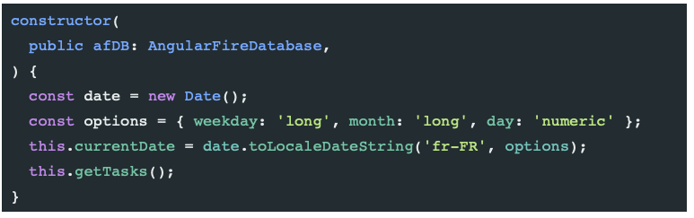

Voila, les tâches sont disponibles, on peut le voir grâce à un petit `console.log("Task : " + this.myTask)` juste sous le `showForm()` pour vérifier dans notre console que tout va bien.

Affichons tout ça sur notre écran.

Pour ça, nous allons utiliser de nouveau la balise [`ion-card`](https://ionicframework.com/docs/api/card).

Dans `home.page.html`, entre la `<ion-card>` prévue pour l'ajout de tâche et le bouton du bas, ajoutez ce code :

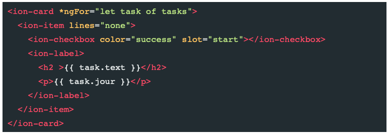

Explications:

- `*ngFor="let task of tasks"` : boucle pour afficher toute la liste de tâches et pas une seule.
- `color="success"`: une nouvelle couleur (vert) pré-enregistrée dans Ionic. De plus, comme est elle dans une check-box, elle ne se mettra que quand la check-box sera "successfull", c'est à dire que la tâche sera remplie.
- `<ion-checkbox>`: une balise ion toute prete pour des check-box.
- `{{task.text}}` : va rechercher la donnée `text` déclarée dans `home.page.ts`

Créons un petit bouton dans notre Header pour pouvoir recharger notre page, et peut-être dans le futur pouvoir partager cette Todo list en ligne et la remplir à plusieurs, un peu à la manière d'un Trello.

Pour ce faire, il suffit de créer un bouton dans le header et de lui faire appeler `getTasks()`, la fonction qui fait l'affichage des tâches.

Voila à quoi ressemble notre header dans `home.page.html` à présent :

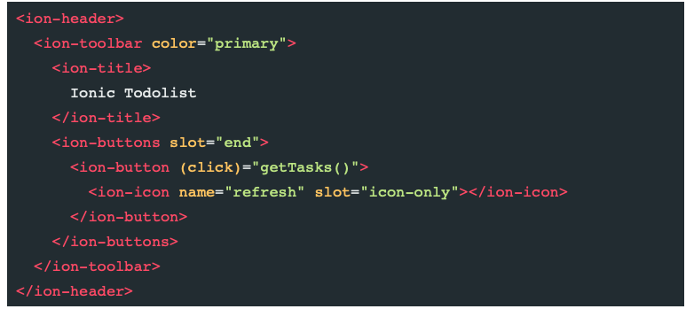

Nous avons enfin un todolist qui ressemble à quelque chose !!<br>
Elle devrait ressembler à ça:

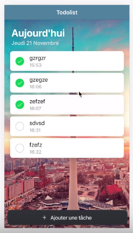

## Connexion de la checkbox avec Firebase

Pour l'instant, notre checkbox n'est reliée à aucune variable, et donc on coche un peu dans le vide.

Nous allons donc, pour que ça veuille vraiment dire quelque chose, relier cette checkbox avec notre base de données Firebase.

Pour ce faire, ajoutez quelques propriétés à la checkbox déjà implémentée:

`<ion-checkbox (ionChange)="changeCheckState(task)" color="success" [(ngModel)]="task.checked" slot="start"></ion-checkbox>`

Explication:

- `[(ngModel)]="task.checked"`: de cette manière, le champs va aller voir si la variable `checked` est à `true` et si c'et le cas, elle colore en vert. Sinon, elle reste vide.
- `(ionChange)="changeCheckState(task)"`: ceci permet d'exécuter la fonction `changeCheckState` à chaque interaction avec la checkbox.

Nous devons créer cette fonction dans le `home.page.ts`, tout simplement en disant à la base de données de changer la valeur de "checked".

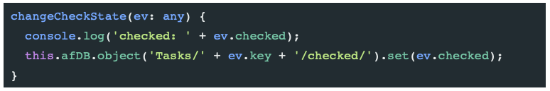

Vous pouvez à présent voir dans votre console Firebase que les données se modifient de façon dynamique en fonction de ce qui est coché ou pas.

Nous pouvons aussi barrer le texte d'une tâche effectuée grâce à une condition mise sur la balise <h2> qui entoure le titre de la tâche.

Il suffit de remplacer la balise `<h2>{{task.text}}</h2>` par

```
      <h2 *ngIf="!task.checked">{{ task.text }}</h2>
      <h2 *ngIf="task.checked" style="text-decoration:line-through;">{{ task.text }}</h2>
```

On voit ici deux ligne d'affichage:

- Si la tâche est cochée, `checked` est à true donc on utilise le style `text-decoration:line-trhought` pour barrer le texte, comme dans un HTML normal dans lequel on met une propriété CSS. Si elle ne l'est pas, le texte s'affiche normalement.

## Supprimer une tâche

Dernière fonctionnalité, la possibilité de supprimer une tâche, qu'elle soit effectuée ou pas.

Nous allons en profiter pour voir une dernière possibilité Ionic: _le slide_.
En effet, nous développons ici quelque chose qui sera principalement du **mobile**. Or, sur tous les smartphones ou presque, la suppression se fait en slidant le champs vers la gauche. <br>
Cette fois encore, Ionic nous montre un de ses avantages avec une propriété toute faite très simple à implémenter.

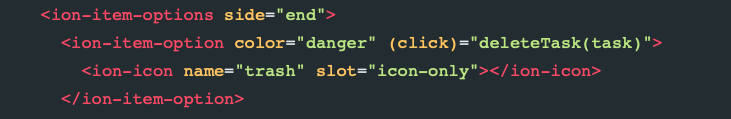

Ainsi que des balises `<ion-item-sliding>` et `</ion-item-sliding>` juste à l'intérieur de la balise `<ion-card *ngFor="let task of tasks">`.

Explications:

- `<ion-item-sliding>`et `</ion-item-sliding>`: Mettre l'option de slide sur la `ion-card`.
- `side="end"`: dit de faire le slide du coté "end", c'est à dire à droite et donc vers la gauche.
- `(click)="deleteTask(task)"`: au click, on appelle la fonction `deleteTask` que nous allons créer maintenant dans le `home.page.ts`

Il y a aussi le name pour l'icone, le `slot="icon-only"` déjà rencontré plus haut et la `color="danger"` qui va donner du rouge.

Il ne reste plus qu'un petite chose à faire, implémenter la fonction `deleteTask()` dans `home.page.ts` en utilisant la fonction `.remove()` d'Ionic à la place de la fonction `.push()` utilisée pour intégrer une nouvelle donnée.

```
deletetask(task:any){
  this.afDB.list('Tasks/).remove(ask.key);
}
```

Et voilaaaaaaa, **Mission Accomplie** !!!

Juste un dernier effort...

Je sais, j'ai déjà dit que c'était la dernière chose à faire au truc précédent... et ben j'ai menti ... Tu va faire quoi ??<br>
Mais là, pour du vrai c'est la dernière, et ça te demande pas vraiment de travailler. (Oui j'ai commencé le tuto en vouvouyant, et maintenat je tutoie, mais c'est parce que on commence à se connaitre avec le temps).

En fait, ça serait quand même sympa de se rendre compte du travail fait et d'utilité dans ce projet d'Ionic et du travail en moins grâce à lui. <br>
Déjà, dans votre inspecteur, changez le device, et passer d'Ios à Android (il faut rafraichir la page après avoir changer). <br>
On peut voir que les chartes graphiques respectives sont respectées, alors que de notre coté, on n'y a pas fait attention, on n'a pas du tout pensé dans notre css à faire en sorte que les boutons soient les mêmes que ceux d'un iphone ou d'un Pixel2.

D'autre part, je vous invite à passer faire un petit tour sur votre fichier `home.page.scss`, et de vous rendre compte du peu de ligne qu'on a du taper.

Ionic fait tout le travail de style pour nous. <br>
Ok, c'est une petite application très simple qu'on vient de faire, mais pour la faire "from scratch" avec simplement du HTML-CSS-JS, ça aurait mis énormément de lignes en plus dans la feuille de style en tout cas.<br>
Aussi, tout est standardisé, mais si on veut nous-même mettre un style particulier pour tel ou tel élément, il est parfaitement possible de mettre des `class` et des `id` sur les balises Ionic et laisser libre cours à notre imagination.

C'est quand même deux énormes avantages.

Un petit défaut qui m'a frappé depuis que j'ai commencé Ionic (5-6jours), c'est qu'il y a beaucoup de balise Ionic à retenir, et quand on commence, c'est comme avec chaque langage, on doit chercher si elle existe et ce qu'elle fait. Mais avec un peu d'habitude, je pense qu'on sait quoi utiliser à quel moemnt et quelles sont les propriétés qui peuvent être prises en compte par ces balises.

**Ca y est !!! Votre TodoList ressemble à l'objectf fixé au départ, et possèdent toutes les fonctionnalités prévues:**


Félicitation, en une matinée, vous avez construit un vrai petit projet utilisable. <br>
Vous avez également appréhender les bases d'Ionic, vous avez entrevu à quel point ça peut être utile et vous vous êtes rendu compte de la possibilité de faire un seul code et de quand même pouvoir déployer sur andrdoid, ios ou en Desktop tout en respectant les chartes graphiques des différentes plateformes.<br>
Et pour finir vous avez un peu vu comment fonctionne Firebase (que je ne connaissais pas) qui est quand même une solution de base de données facile, et même si le service est limité en terme de gratuité, il y a déjà moyen de faire du lourd avant de devoir mettre la main à la poche.

Merci d'avoir suivi ce workshop/tuto, j'espère que ça vous a plu autant qu'à moi (peut-être même plus parce que taper tout ce texte, j'avoue à la fin,j'en avais un peu marre) et que vous appris quelque chose.

Bonne journée, et à bientot pour de nouvelles aventures.

Simon Jolet

#### NB:

Ce workshop est réalisé dans le cadre de la formation Becode.
Mon lieu de stage m'a demandé de me familiarisé avec l'environnemnt de développement mobile Ionic, et j'ai voulu en faire profiter mes camarades Becodiens.
